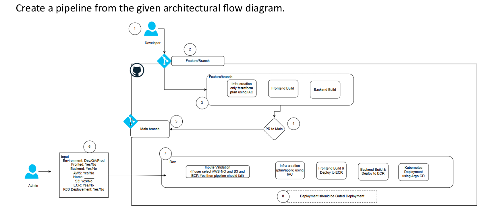

# ***CI/CD DAY - 2***

---

Q4. As DevOps engineer implement a solution for the below scenario,

Project team was using mainline strategy with manual deployment now they are moving away and implementing the DevOps practices. Their plan is to move to GitOps branching strategy to support deployment to multiple environments simultaneously. Teams will have 3 long living branches, those are Dev, QA, Prod, and each environment has their own namespace and configuration (Dev/QA/Prod Namespaces). So, create a GitHub Action workflow with the suggested branching strategy which follows the flows, so the deployment of higher environments only goes though the PR merges from the low long living branches.
Dev branch --> Dev environment
QA branch --> QA environment
Prod branch --> Prod environment

---

* Adopt a GitOps branching strategy with three long-living branches: Dev, QA, and Prod.
* Map each branch directly to its corresponding environment and namespace.
* Configure Dev branch deployments to target the Dev namespace.
* Configure QA branch deployments to target the QA namespace.
* Configure Prod branch deployments to target the Prod namespace.
* Create a GitHub Actions workflow that triggers on pushes and pull request merges to these branches.
* Allow direct development and testing changes only in the Dev branch.
* Enforce promotion from Dev to QA exclusively through pull request merges.
* Block direct commits to the QA branch.
* Enforce promotion from QA to Prod exclusively through pull request merges.
* Block direct commits to the Prod branch.
* Apply branch protection rules to require pull request reviews for QA and Prod.
* Ensure QA deployment runs only after a successful merge from Dev.
* Ensure Prod deployment runs only after a successful merge from QA.
* Use environment-specific configuration files or variables per branch.
* Ensure each deployment job references the correct namespace based on branch name.
* Implement environment scoping in GitHub Actions using branch conditions.
* Prevent lower environments from deploying from higher branches.
* Validate deployments by merging Dev → QA and QA → Prod sequentially.

---

1. Developer creates a feature branch from the main branch.
2. Any push to the feature branch triggers the CI pipeline.
3. On the feature branch, run infrastructure validation using Terraform plan only (no apply).
4. Build frontend components if frontend changes are detected.
5. Build backend components if backend changes are detected.
6. Raise a Pull Request from the feature branch to the main branch.
7. On PR creation, run validation checks and block merge if CI fails.
8. After PR approval, merge changes into the main branch.
9. Merging to main triggers the deployment pipeline.
10. Admin manually triggers the deployment pipeline with input parameters.
11. Accept deployment inputs such as environment (Dev/QA/Prod), frontend flag, backend flag, AWS flag, S3 flag, ECR flag, and Kubernetes deployment flag.
12. Validate inputs and fail the pipeline if invalid combinations are selected.
13. Based on selected environment, deploy only to the corresponding namespace.
14. Run Terraform plan and apply to create or update infrastructure.
15. Build frontend artifacts and push images to Amazon ECR if enabled.
16. Build backend artifacts and push images to Amazon ECR if enabled.
17. Deploy Kubernetes workloads using Argo CD when Kubernetes deployment is enabled.
18. Ensure deployments to higher environments are gated and require approval.
19. Enforce manual approval for production deployments.
20. Complete deployment only after approval is granted and all stages succeed.
