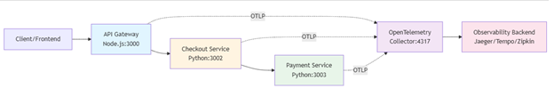

# ***SRE/Observability***

---

Objective 2:
Implement end-to-end observability for the given Python microservices on a WSL-based Docker environment using Prometheus and Grafana to detect and analyze latency issues.
Tasks:

1. Instrument service-a and service-b to expose Prometheus metrics, including request count and service-a’s average wait/response time (latency) when calling service-b.
2. Deploy both services as Docker containers on the WSL machine.
3. Configure a Prometheus server (running in Docker on WSL) to scrape metrics from both services.t
4. Set up a Grafana dashboard (running in Docker on WSL) to visualize traffic volume and latency for both services.

* Identify service-a and service-b request flow and the interaction where service-a calls service-b.
* Add Prometheus client instrumentation to both Python services.
* Expose a /metrics endpoint in service-a and service-b.
* Instrument service-a to record total request count.
* Instrument service-b to record total request count.
* Measure and expose latency in service-a for calls made to service-b (average response/wait time).
* Validate metrics locally by accessing the /metrics endpoint of both services.
* Create Docker images for service-a and service-b.
* Run both services as Docker containers on the WSL environment with exposed ports.
* Create a Prometheus configuration to scrape metrics from service-a and service-b containers.
* Deploy Prometheus as a Docker container on WSL using the scrape configuration.
* Verify Prometheus successfully collects metrics from both services.
* Deploy Grafana as a Docker container on WSL.
* Configure Prometheus as a data source in Grafana.
* Create Grafana dashboards to visualize request count (traffic volume) for service-a and service-b.
* Create Grafana panels to visualize latency metrics for service-a calls to service-b.
* Generate traffic between services to observe metric changes.
* Use Grafana dashboards to detect and analyze latency issues between service-a and service-b.

---

**Objective 3:**

Deploy a resilient and secure ELK (Elasticsearch, Logstash, Kibana) stack on Kubernetes using helm, integrated with Filebeat agents to collect and visualize logs from a dummy application, ensuring persistent storage and secure credentials.

**Tasks:**

1. Deploy Elasticsearch as a StatefulSet with persistent storage and required sysctl settings in the logging namespace.
2. Deploy Logstash with a ConfigMap pipeline (input from Beats, filter for "ERROR" logs, output to Elasticsearch) and secure credentials using Kubernetes Secrets.
3. Deploy a dummy log-generating app in app-space and Filebeat as a DaemonSet to ship logs from /var/log/pods to Logstash.
4. Deploy Kibana connected to Elasticsearch, expose it for access, and create a dashboard filtering for the priority_alert tag.

* Create a dedicated Kubernetes namespace for logging components.
* Deploy Elasticsearch using Helm as a StatefulSet in the logging namespace.
* Enable persistent volume claims for Elasticsearch data storage.
* Configure required sysctl settings to support Elasticsearch memory and file limits.
* Secure Elasticsearch access using Kubernetes Secrets for credentials.
* Deploy Logstash using Helm in the logging namespace.
* Define Logstash pipeline configuration using a ConfigMap.
* Configure Logstash input to receive logs from Beats.
* Apply a filter in Logstash to match and tag logs containing the keyword “ERROR”.
* Configure Logstash output to forward processed logs to Elasticsearch securely.
* Create a separate namespace for application workloads.
* Deploy a dummy application that continuously generates logs in the app namespace.
* Deploy Filebeat as a DaemonSet across all nodes.
* Configure Filebeat to collect logs from /var/log/pods.
* Configure Filebeat to forward logs to Logstash securely.
* Verify logs are successfully indexed in Elasticsearch.
* Deploy Kibana using Helm in the logging namespace.
* Connect Kibana to Elasticsearch using secure credentials.
* Expose Kibana access using a Kubernetes Service or Ingress.
* Create a Kibana dashboard filtering logs with the priority_alert tag.

---

**Objective 4:**

Insturment the provided Python flask application with Open telemetry to collect traces and metrics.

**Tasks:**

1. Install OpenTelemetry Dependencies: Add the necessary Opentelemetry packages to requirements.txt and install and build the application.

2.Instrument the application: Modify the app.py for the following functionality:

a. Initialize Opentelemetry SDK with proper configuration

b.Configure the OTLP exporter to send data

c.Enable automatic instrumentation for Flask

d.Add a custom span for the database lookup operations

e.Set span attributes for user IDs and request metadata

 3.Add Custom Metrics: Implement the following metrics:

a. A counter for total API requests

b.A histogram for request duration

c.A counter for user creation events

d. Implement a custom span event for an operation of your choice and explain its significance

4.Test your implementation:

a.Run the instrumented application

b.Make several HTTP requrests to different end points

c.Verify that the traces are being exported.

* Identify the existing Flask application structure and request flow.
* Add required OpenTelemetry API, SDK, exporter, and instrumentation dependencies to requirements.txt.
* Install dependencies and rebuild the application.
* Initialize the OpenTelemetry SDK during application startup.
* Configure the OTLP exporter to send traces and metrics to the configured backend.
* Set up a tracer provider and meter provider with appropriate resource attributes.
* Enable automatic Flask instrumentation to capture incoming HTTP requests.
* Add a custom span around database lookup operations.
* Set span attributes for user ID and relevant request metadata.
* Create a counter metric to track total API requests.
* Create a histogram metric to record request duration.
* Create a counter metric to track user creation events.
* Add a custom span event for a significant operation and document its purpose.
* Run the instrumented Flask application.
* Generate traffic by making HTTP requests to multiple endpoints.
* Verify traces are generated for requests and database operations.
* Verify custom metrics are being recorded correctly.
* Confirm traces and metrics are successfully exported to the telemetry backend.

---

**Objective 5:**

You’ve been called in to troubleshoot an issue at an eCommerce platform. The company recently instrumented their services with OpenTelemetry, but the observability team is reporting problems:

1. Missing Traces: Traces are not showing up in the backend
2. Broken Trace Context: The checkout service's calls to the payment service appear as separate, unrelated traces
3. Memory Leak: The `checkout-service` memory usage keeps growing over time.

   

**Tasks:**

1. Identify the bugs in the OpenTelemetry implementation across the three services.
2. Explain what each bug is causing (missing traces, memory leak, broken trace context).
3. Fix the code for each service.
4. Configure tail based sampling.
5. Implement dynamic sampling based on error rates.
6. Implement cardinality limits for metric labels.

* Review OpenTelemetry initialization in API Gateway, checkout-service, and payment-service.
* Identify missing or incorrect OTLP exporter configuration causing traces not to reach the collector.
* Identify incorrect collector endpoint/port or protocol mismatch leading to missing traces.
* Identify missing SDK initialization order issues causing spans to be dropped early.
* Identify missing context propagation configuration between checkout-service and payment-service.
* Identify HTTP client instrumentation not enabled for inter-service calls.
* Identify manual span creation without attaching to the incoming request context.
* Identify multiple tracer or meter providers being created per request in checkout-service.
* Identify unbounded span processors/exporters not being reused or flushed properly.
* Identify high-cardinality metric labels (userId, orderId, requestId) causing memory growth.
* Fix missing traces by initializing a single global tracer and meter provider per service.
* Fix exporter issues by configuring OTLP exporter consistently across all services.
* Fix broken trace context by enabling W3C Trace Context propagation.
* Ensure checkout-service forwards trace context headers to payment-service.
* Ensure payment-service extracts incoming trace context correctly.
* Fix memory leak by moving OpenTelemetry initialization to application startup only.
* Fix memory leak by using batch processors and proper shutdown handling.
* Configure tail-based sampling in the OpenTelemetry Collector.
* Retain traces based on latency, error status, or specific attributes using tail sampling.
* Implement dynamic sampling to increase sampling rate when error rate exceeds thresholds.
* Reduce sampling rate automatically during normal traffic conditions.
* Enforce metric label cardinality limits by removing user-specific identifiers.
* Replace high-cardinality labels with low-cardinality attributes (status, route, method).
* Validate fixes by generating traffic and confirming end-to-end trace continuity.
* Verify traces appear correctly in the backend and memory usage stabilizes.
